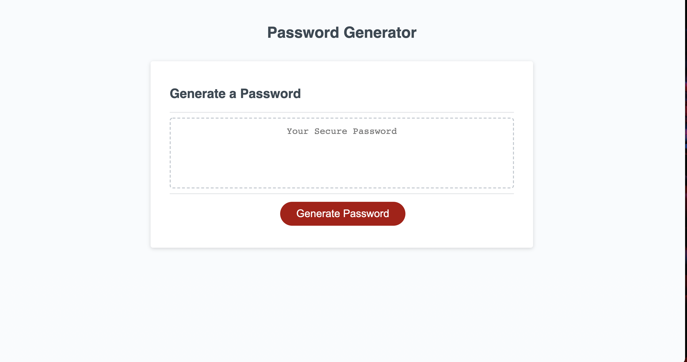
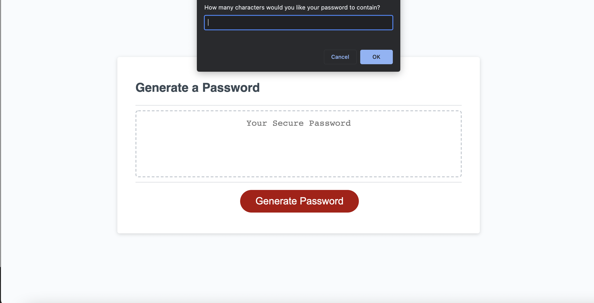
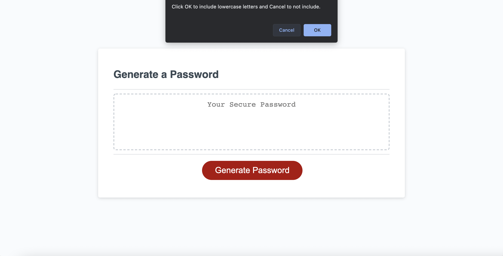
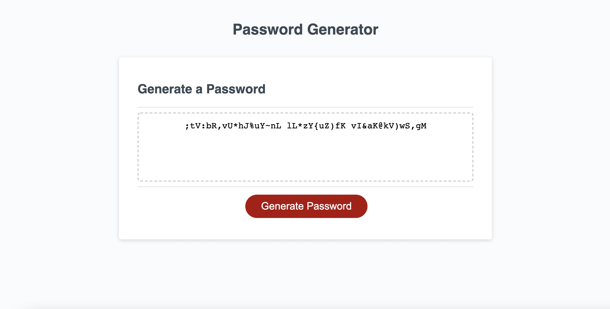

# Password-Generator

This password generator allows a user to create his or her own unique password that will be randomized each time the application is used. The user is asked for input regarding the length of the password they desire as well as confirmation regarding what kinds of characters they would like to see it contain. He or she is then presented with what they have requested.

## Features and Functionality

Upon the opening of this webpage a "Generate Password" button exists which begins the creation process. Once clicked, the user is then prompted to enter a number in regards to desired character length. The input is validated for a length of no less than 8 or no more than 128 characters long. Alert boxes show when the input is out of range or the type is not a number allowing him or her to begin again.

Confirm boxes then follow in which the user can either click "OK" or "Cancel" to in terms of including special characters, numbers, lowercase letters and uppercase letters. "OK" signifies yes to including them and "Cancel" signifies no. Should the user click "Cancel" to all given options, an alert arises to inform him or her that at least one type of character must be selected, and the confirm boxes begin again.

Once every box has been answered, a password is randomly generated based on the user input.

Click link below to view full video. https://drive.google.com/file/d/1JexvXtlHC50AfqdkmXoZ0UMkCyedTVQA/view

## Deployment Access

https://cianfich1016.github.io/Password-Generator/

## License

Library can be found at the following link.

https://github.com/cianfich1016/Password-Generator

Starter code borrowed from Trilogy Education Services.

This project is licensed under the terms of the MIT license.

